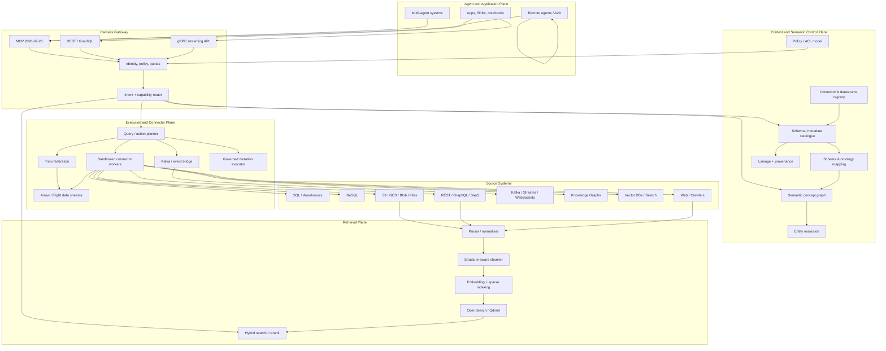
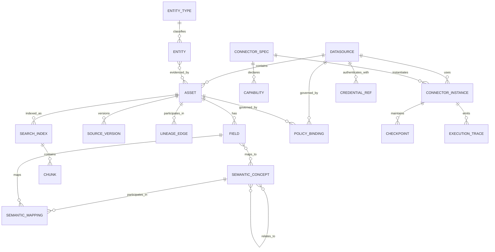

# Datasource Harness for Multi-Agent Systems: Architecture, Technology Landscape and Product Roadmap

## Executive summary

A sector-agnostic datasource harness for multi-agent systems should **not** be built as another monolithic “universal connector” library. The more defensible architecture is a **capability-negotiated data-access fabric** with four separable concerns: a connector/data plane, a metadata-and-semantic control plane, a retrieval/indexing plane, and an agent-facing protocol plane. This separation matters because the underlying systems have fundamentally different execution semantics: SQL databases want query push-down and transactions; SaaS APIs want pagination, quotas and OAuth; streams want offsets and checkpoints; object stores want scans and manifests; document stores want parsing and retrieval; vector databases want similarity search; and knowledge graphs want graph-pattern semantics. Existing projects solve important pieces of this problem, but no single open-source project currently combines all of them cleanly. Trino excels at federated structured querying; Airbyte and dlt at connectors/data movement; Kafka Connect at streaming adapters; Apache Arrow ADBC/Flight SQL at efficient database interoperability; DataHub/OpenMetadata at metadata context; Ontop at ontology-mediated virtual knowledge graphs; Splink at entity resolution; and OpenSearch/Qdrant/Haystack/LlamaIndex at retrieval. citeturn16search0turn16search1turn16search2turn16search9turn15search3turn17search3turn18search8turn17search4

The most important architectural decision is therefore to make **the harness contract smaller than the union of all datasource APIs**. A connector should advertise capabilities such as `DISCOVER`, `QUERY`, `SCAN`, `SEARCH`, `SUBSCRIBE`, `MUTATE`, `TRANSACTION`, `CDC`, `PUSHDOWN`, and consistency guarantees. Consumers negotiate those capabilities rather than assuming relational semantics everywhere. Apache Arrow ADBC already demonstrates the value of separating a common client API from wire protocols; Flight SQL in turn demonstrates how a database-neutral wire protocol can support ADBC, JDBC and ODBC clients. citeturn15search3turn15search11turn15search15

For agents, **MCP should be the primary northbound tool/context interface, not the internal connector ABI**. The authoritative MCP `2026-07-28` specification standardises LLM-to-tool/data integration; its latest major revision makes the core stateless, which materially improves ordinary HTTP, load-balanced and serverless deployment. A2A should sit beside MCP for agent-to-agent delegation rather than underneath database connectors: the Linux Foundation explicitly characterises A2A as agent communication and MCP as agent-to-tools/data connectivity. citeturn19search24turn19search8turn19search17

The product should maintain **two access paths** rather than trying to answer everything through RAG:

1. **Live execution** for structured, transactional, current or high-value data: discover the appropriate assets/semantics, construct a governed query, then execute against the source or a federation engine.
2. **Indexed retrieval** for documents, web content, metadata, schemas and other search-oriented information: hybrid lexical+dense/sparse retrieval, metadata/ACL filtering, reranking, provenance and freshness management.

Modern retrieval evidence supports this distinction. Recent benchmarking found hybrid retrieval followed by neural reranking stronger than single-stage approaches on mixed text-and-table material, while RAG studies continue to show that chunking strategy materially affects retrieval and downstream quality. OpenSearch and Qdrant both expose native hybrid lexical/vector or dense/sparse fusion capabilities. citeturn20search3turn20search7turn5search2turn5search7

The semantic layer should similarly be **probabilistic but governed**, not an LLM-generated global schema. Research since 2024 increasingly converges on retrieve/candidate-generate → rerank/validate pipelines for schema and ontology matching. ReMatch uses retrieval-enhanced LLM matching; Magneto uses smaller models for candidate retrieval and LLMs for reranking; MILA avoids LLM calls on high-confidence ontology matches; and work on scalable LLM schema mapping identifies inconsistent outputs, context-window limits and inference cost as practical problems. citeturn20search0turn20search1turn20search2turn20search32

**Recommended product position:** build an **open, protocol-first “data context and execution fabric for agents”**, rather than an ETL platform, vector database or MCP-server collection. Its moat should be the connector SDK and conformance suite, canonical capability model, governed semantic mappings, policy-aware retrieval/execution, provenance/freshness semantics, and an agent-optimised API surface. CData Connect AI and MindsDB already validate demand for a universal agent data layer: CData now exposes a governed MCP layer over more than 350 enterprise sources, while MindsDB positions a single SQL-like query surface over more than 200 sources. Airbyte is also explicitly extending its 600+ connector estate towards agents. citeturn22search6turn22search3turn16search0

The recommended implementation is deliberately polyglot and modular:

| Layer | Recommended default | Why |
|---|---|---|
| Agent interface | MCP `2026-07-28`, plus REST; A2A for agent delegation | Standardised agent/tool boundary; stateless MCP now maps well to scalable HTTP infrastructure. citeturn19search8turn19search17 |
| High-throughput internal RPC | gRPC + Protobuf; Arrow/Flight for record streams | Typed contracts, streaming RPCs and efficient columnar transfer. citeturn15search5turn15search16turn15search3 |
| Connector SDK | Python first; Go SDK second; JVM bridge for JDBC/Kafka ecosystem | Python gives broad API/data ecosystem; JVM interoperability covers mature JDBC and Kafka connectors. |
| Canonical tabular representation | Apache Arrow `RecordBatch` | Avoids forcing row-by-row representations and is the native basis of ADBC/Flight SQL. citeturn15search11turn15search33 |
| Structured federation | Trino as optional execution backend | Distributed SQL across heterogeneous catalogues, including databases, object/lake systems, Kafka and NoSQL. citeturn16search2turn16search5 |
| Streaming | Kafka/Kafka Connect-compatible event bridge | Mature source/sink abstraction and offset/checkpoint model. citeturn16search9turn16search3 |
| Metadata/context | Internal minimal metadata graph; DataHub adapter as preferred OSS integration | Avoids hard dependency while taking advantage of DataHub lineage/context/MCP ecosystem. citeturn17search0turn17search3 |
| Search | OpenSearch default; Qdrant optional vector-first backend | OpenSearch combines lexical and vector retrieval; Qdrant provides dense+sparse/multivector fusion. citeturn5search2turn5search7 |
| Entity resolution | Splink | Mature probabilistic linkage without requiring an LLM. citeturn14search4turn14search0 |
| Ontology mediation | Ontop optional semantic adapter | Standards-based R2RML/RDF/SPARQL/OWL 2 QL virtualisation over relational data. citeturn17search4turn17search10 |
| Policy | OPA + optional OpenFGA | Policy-as-code plus fine-grained relationship-based authorisation. citeturn8search18turn8search3 |
| Workload identity | SPIFFE/SPIRE | Short-lived, attested X.509 identities suitable for mTLS. citeturn21search1turn21search5 |
| Telemetry | OpenTelemetry | Existing database, messaging and emerging GenAI/agent semantic conventions. citeturn21search4turn21search8turn21search18 |
| Deployment | Kubernetes baseline; serverless for stateless northbound/control functions | Fits isolated long-running connector workers while exploiting stateless MCP for bursty edge/API workloads. citeturn19search8 |

## Market, standards and latest developments

The market has changed materially in the last eighteen months. “Connect an LLM to a database” is giving way to **context infrastructure** in which discovery, governance, semantics, retrieval, actions and agent identity are part of the data access layer itself.

The clearest standards signal is MCP. The official specification defines it as an open protocol connecting LLM applications with external sources and tools. The July 28, 2026 release removed MCP's former initialise/session handshake from the core: protocol version and capabilities accompany requests, creating a stateless request model. The release also introduced a formal extensions framework and improved alignment with OAuth/OpenID Connect deployments. citeturn19search24turn19search0turn19search8

> “MCP is an open protocol that enables seamless integration between LLM applications and external data sources and tools.” citeturn19search24

MCP's security model is also maturing towards ordinary enterprise identity architecture. Current official guidance describes OAuth 2.1-oriented authorisation for remote servers, while Streamable HTTP carries JSON-RPC 2.0 and can use bearer tokens and conventional HTTP authentication. The official MCP Inspector now provides web, CLI and TUI clients and is suitable for CI-level server testing. citeturn15search0turn15search8turn15search4

A2A has simultaneously stabilised the complementary agent-to-agent layer. Google donated the protocol into Linux Foundation governance in June 2025, and A2A v1.0 now defines an interoperable model for independent, potentially opaque agents; its normative definition supports JSON-RPC, gRPC and HTTP+JSON bindings. The Linux Foundation reported in April 2026 that more than 150 organisations were participating in the A2A ecosystem and explicitly distinguished A2A's inter-agent role from MCP's data/tool role. citeturn19search3turn19search2turn19search26turn19search17

Governance is becoming less vendor-specific as well. The Linux Foundation launched the Agentic AI Foundation in December 2025 with MCP among its foundational technologies and participation from AWS, Anthropic, Google, Microsoft, OpenAI and numerous enterprise vendors. This substantially reduces the architectural risk of treating MCP as an important northbound standard, although the protocol is still evolving rapidly enough that version negotiation must remain explicit. citeturn19search1turn19search8

The data-platform vendors are converging on the same opportunity from different directions:

| Date | Development | Strategic significance |
|---|---|---|
| July 28, 2026 | MCP `2026-07-28` released with a stateless core and extensions framework. citeturn19search0turn19search28 | Makes MCP considerably more suitable for horizontally scaled gateways and serverless deployments. |
| August 3, 2026 | DataHub Cloud 2.1 made agents, MCP servers and REST/GraphQL/gRPC services first-class governed catalogue entities and introduced scoped MCP servers. citeturn17search7 | Metadata catalogues are evolving into agent context/control planes. |
| August 24, 2026 | OpenMetadata 2.0.0 was released, following 1.13.4 three days earlier; 2.0 includes a data-quality overhaul and continues the project's MCP/context evolution. citeturn18search0turn18search3 | Active competing open context layer with very recent development, but licensing requires careful component-level examination. |
| June 23, 2026 | CData made a Connect AI Developer Edition available and released a Python DB-API 2.0 SDK. citeturn22search0 | Commercial validation for exposing hundreds of sources through a unified agent-oriented interface. |
| March 2026 | CData added universal, custom and source-specific MCP tool tiers over 350+ enterprise systems. citeturn22search6 | Strong evidence that “one MCP tool per underlying API operation” is the wrong abstraction at scale. |
| 2026 | MindsDB continues to present one SQL dialect over 200+ databases, warehouses, SaaS systems, document stores and vector indexes. citeturn22search3turn22search5 | Demonstrates the usefulness—and limitations—of a relational-looking universal surface for agents. |
| 2026 | Airbyte's main repository now explicitly describes both the 600+ connector data-movement platform and an Agent SDK exposing source connectivity to LLM/tool frameworks. citeturn16search0 | Mature connector ecosystems are moving “up-stack” towards agents rather than remaining pure ETL. |
| 2026 | DataHub is positioning its metadata graph as a context graph for agents; its Agent Context Kit and MCP interface expose metadata, lineage and business context. citeturn17search2turn17search3 | A useful pattern for keeping semantic context separate from raw data transport. |

Three industry positions are emerging.

**The “universal query surface” position** is represented most directly by MindsDB and CData. The benefit is dramatic simplification of the agent tool space. CData's current design is particularly instructive: rather than registering hundreds of source-specific MCP methods, its “Universal Tools” work through a common relational interface, with separately governed custom/source tools for specialised operations. citeturn22search6

**The “context graph” position** is increasingly represented by DataHub and OpenMetadata. DataHub Cloud 2.1 catalogues APIs, MCP servers, agents, semantic models and lineage within one governed graph; OpenMetadata now describes itself as an open context layer and exposes APIs, SDKs, events, webhooks and semantic search to agent applications. citeturn17search7turn18search8

**The “connector estate becomes an agent interface” position** is represented by Airbyte, CData and to a lesser extent dlt. This is attractive for breadth but does not itself solve cross-source semantics, entity identity, live query planning, policy composition or retrieval quality. Airbyte's 600+ connector catalogue is an enormous accelerant, but it remains rooted in data movement, while dlt is deliberately a Python-first loading library supporting pipelines from APIs/databases/files towards databases, lakes and vector destinations. citeturn16search0turn16search1

The resulting product opportunity sits **between** those positions: reusable connectivity below, governed meaning and retrieval above, and a thin agent protocol surface on top.

## Comparative landscape

The following maturity ratings are an architectural assessment as of **August 26, 2026**, rather than vendor-provided scores. “High” means a component is credible as a production dependency for its intended function; it does not imply that it can serve as the complete proposed harness.

### Core access, federation and connector projects

| Project | Primary function and source coverage | Connector / adapter model | Protocol / execution characteristics | Language and licence | Semantic / retrieval capability | Maturity and fit |
|---|---|---|---|---|---|---|
| **Airbyte** | 600+ connectors covering APIs, databases, warehouses, lakes and AI-oriented destinations. citeturn16search0 | Declarative/no-code builder plus low-code Python CDK; source/destination replication model. citeturn0search39turn16search0 | HTTP/API/database connectors; orchestration API; newer Agent SDK/MCP direction. | Predominantly Python/Java. **Licence is heterogeneous**: several connector packages are ELv2 while the CDK has permissive components, so embedding needs component-level review. citeturn11search6turn11search18 | Vector destinations and agent-facing source access exist, but cross-source semantics are not its core abstraction. | **High** for connector breadth; **medium** as embedded harness foundation because replication concepts and licensing leak into the design. |
| **dlt** | Python-first extraction/loading from APIs, databases and files into databases, lakes and vector destinations. citeturn16search1 | In-process Python source/resources/destinations; schema inference and incremental loading. | Python-native; suitable inside serverless functions, notebooks, agents or orchestrators. | Python, **Apache-2.0**; current metadata marks the library production/stable. citeturn16search1turn16search4 | Useful schema normalisation but not a global semantic/ontology layer. | **High** as an embeddable Python connector SDK reference; especially attractive for MVP long-tail connectors. |
| **Trino** | Distributed federated SQL across relational systems, object/lake formats, Kafka and various NoSQL/analytics engines. citeturn16search2turn16search5 | Each datasource becomes a configured catalogue backed by a connector. | ANSI-oriented SQL query engine; push-down varies by connector. | Java, **Apache-2.0**. citeturn16search2 | No RAG layer; semantic meaning largely external to query engine. | **Very high** for live structured federation. Use behind the harness rather than recreating distributed SQL. |
| **Apache Arrow ADBC + Flight SQL** | Database-access abstraction optimised for Arrow-native/bulk columnar exchange. | Driver API and network protocol deliberately separated. | ADBC client API; Flight SQL wire protocol; compatibility path to JDBC/ODBC. citeturn15search3turn15search33 | C/C++, Go, Java, Python and others; Apache ecosystem. | None by itself. | **High** as canonical tabular transport/driver inspiration; excellent internal ABI choice. |
| **Kafka Connect** | Reusable source/sink adapters between Kafka and external event/data systems; the Kafka ecosystem describes hundreds of integrations. citeturn16search9turn16search20 | `Connector` + partitioned `Task` model, offsets, converters and worker runtime. | Kafka protocol; distributed workers; source/sink semantics. | JVM, Apache project. | None directly. | **Very high** for event/CDC adapters. Do not reinvent its mature checkpointing model. |
| **Pathway** | Live ETL/stream processing and RAG over changing sources with a Python API and Rust execution engine. citeturn17search1 | Streaming dataflow; connectors feed incremental computations and indexes. | Live/incremental engine; container and Kubernetes deployment. | Python/Rust, **BSL 1.1**, converting to Apache 2.0 after four years for covered code. citeturn17search1 | Strong real-time RAG/index freshness position. | **Medium-high**, technologically interesting but BSL licensing makes it better as an optional integration than a core dependency. |
| **MindsDB Query Engine / MindsHub ecosystem** | One SQL-like surface over 200+ databases, warehouses, SaaS apps, document stores and vector indexes. citeturn22search3turn22search5 | Integration plugins behind a federated query abstraction. | SQL plus MCP-facing agent integration. citeturn22search1 | Current MindsHub superproject is open source; licence boundaries among constituent components should be evaluated separately. citeturn13view0 | Knowledge Bases add unstructured/vector retrieval. | **High conceptual relevance**: one of the closest OSS comparisons to the proposed query surface; product structure is evolving rapidly. |

### Context, semantics, entity resolution and retrieval projects

| Project | Core capability | Sources / connectors | Semantic intelligence | Retrieval | Language / licence | Recommended role |
|---|---|---|---|---|---|---|
| **DataHub** | Metadata graph, discovery, ownership, lineage, quality and increasingly agent/context governance. citeturn17search3turn17search7 | Broad metadata ingestion ecosystem across warehouses, streams, BI, pipelines and files. | Strong glossary/metadata/lineage graph; current roadmap includes first-class semantic models/metrics and agent context. citeturn17search7turn17search11 | Semantic context documents and MCP-based retrieval in commercial/context offering. | JVM/Python ecosystem, **Apache-2.0 OSS**. citeturn3search6 | Best default external **metadata/context graph adapter**; avoid coupling core connector ABI to it. |
| **OpenMetadata** | Metadata, lineage, quality, glossary, governance and AI/context APIs. citeturn18search8 | Databases, dashboards, pipelines, messaging, ML and other metadata integrations. citeturn18search5 | Glossary/context, semantic search and agent SDK. | Semantic search over assets and context. citeturn18search8 | Java/Python/TS. **Mixed licensing**: parts remain Apache-labelled, while ingestion code is now Collate Community License 1.0. citeturn18search1turn18search16 | Strong alternate context platform, but licence boundaries merit explicit legal review before embedding. |
| **Ontop** | Virtual Knowledge Graph over relational data without materialising a new copy. citeturn17search4 | PostgreSQL, MySQL, Oracle, SQL Server, Snowflake, BigQuery, Databricks, Redshift, DuckDB and federators including Trino/Dremio. citeturn17search4 | **Excellent formal semantics:** RDF 1.1, RDFS, OWL 2 QL, R2RML and SPARQL 1.1. | Graph query rather than vector RAG. | Java, **Apache-2.0**. citeturn17search4 | v1/v2 semantic virtualisation module. Particularly useful when organisations already have ontologies. |
| **Splink** | Probabilistic record linkage/entity resolution where no common unique identifier exists. citeturn14search4 | Tabular datasets via supported execution backends. | Entity identity probabilities, blocking and deduplication rather than ontology mapping. | N/A. | Python, **MIT**. citeturn14search0 | Default non-LLM entity-resolution component. |
| **LlamaIndex** | Agentic data framework for document/data ingestion, indexing, retrieval and tools. citeturn14search1 | Large integration ecosystem for documents, APIs, databases and retrieval systems. | Flexible but mostly application-level abstractions rather than durable enterprise ontology. | Rich indices/retrievers/RAG. | Python, **MIT** core. citeturn14search5turn14search19 | Good SDK/integration inspiration; avoid making it the canonical data contract. |
| **Haystack** | Modular RAG and agent pipeline framework. | Connectors/document stores through integrations. | Application pipeline semantics. | Hybrid retrievers, reranking and RAG components. citeturn5search6turn5search9 | Python, **Apache-2.0**. citeturn6search1 | Useful retrieval/orchestration library, particularly for experimentation and eval pipelines. |
| **OpenSearch** | Distributed keyword, vector and analytics/search engine. | Search-index ingest ecosystem. | Metadata filtering rather than ontology. | BM25/lexical, neural vector and hybrid search with score normalisation/combination. citeturn5search2turn5search11 | Java, **Apache-2.0**. citeturn14search2 | Recommended default general-purpose retrieval index because it covers both keyword and vector retrieval. |
| **Qdrant** | Vector/search engine with filtering. | SDK/client integrations rather than universal source connectors. | Metadata filtering. | Dense, sparse and multivector hybrid queries; RRF/DBSF fusion. citeturn5search7 | Rust, **Apache-2.0**. citeturn6search2 | Excellent vector-first backend behind a Search SPI. |
| **Unstructured** | Parsing/partitioning/ingestion for PDFs, HTML, Office files and related unstructured formats. citeturn11search14 | Source/destination connectors oriented to document ingestion. citeturn10search23 | Document structure extraction, not enterprise semantics. | Prepares content for downstream RAG. | Python; OSS libraries include **Apache-2.0** components. citeturn11search17turn11search29 | Preferred parser layer for initial document ingestion, behind a parser SPI. |

No entry dominates the matrix because the axes genuinely differ. The key architectural mistake would be choosing one row and stretching it until it becomes the whole platform.

A useful **build-versus-integrate coverage map** is therefore:

| Capability | Build as core IP | Compose existing OSS | Expose external plug-in |
|---|:---:|:---:|:---:|
| Connector capability contract / manifest | **●** | | |
| Connector runtime/sandbox | **●** | ◐ dlt/Kafka patterns | |
| SQL federation | | **● Trino** | |
| Columnar data transport | | **● Arrow/ADBC** | |
| Stream engine | | **● Kafka/Kafka Connect** | ◐ Pathway |
| Metadata graph model | **● minimal model** | ◐ DataHub | ◐ OpenMetadata |
| Lexicon/schema discovery | **●** | | |
| Mapping candidate/reranking pipeline | **●** | ◐ embedding/LLM libs | |
| Formal ontology query | | ◐ Ontop | **● optional** |
| Entity resolution | | **● Splink** | |
| Hybrid search API | **● facade** | **● OpenSearch/Qdrant** | |
| Document parsing | | **● Unstructured** | |
| Agent protocol | | **● MCP SDK** | |
| Agent-to-agent | | **● A2A SDK** | |
| Policy semantics | **● data-specific policy model** | **● OPA/OpenFGA** | |
| Telemetry conventions | **● harness-specific spans** | **● OpenTelemetry** | |

This concentrates proprietary engineering on the parts that are still missing from the ecosystem rather than duplicating database, stream-processing or vector-search engines.

## Recommended target architecture

The target architecture should explicitly separate a **northbound interaction plane**, a **control/context plane** and a **southbound execution plane**.



MCP belongs at the edge because it defines the agent/tool contract, while the internal data plane needs much richer semantics around streaming, cancellation, back-pressure and binary/columnar data. MCP Streamable HTTP uses JSON-RPC 2.0 and optional SSE, while gRPC has explicit unary and streaming service semantics. Arrow Flight/ADBC is consequently a substantially better internal mechanism for transferring large tabular result sets than embedding millions of rows into MCP JSON payloads. citeturn15search8turn15search5turn15search16turn15search3

### The connector contract

The heart of the system should be a versioned `ConnectorManifest`, approximately:

```yaml
connector:
  id: postgres
  version: 1.4.0
  sdk_api: harness.connector/v1

runtime:
  mode: process            # process | container | wasm | remote
  languages: [python]
  resource_profile: medium

data_models:
  - tabular
  - change_event

capabilities:
  discover: true
  read: true
  query: true
  search: false
  subscribe: true
  mutate: true
  transactions: true
  ddl: false
  predicate_pushdown: true
  projection_pushdown: true

protocols:
  southbound: [postgres_wire]
  northbound_internal: [grpc, arrow]

authentication:
  - username_password
  - oauth2
  - cloud_iam
  - client_certificate

consistency:
  reads:
    - read_committed
    - repeatable_read
    - serializable
  change_delivery:
    guarantee: at_least_once
    resumable: true

schema:
  discovery: live
  change_detection: true

limits:
  max_parallelism: 32
  supports_cancellation: true
  rate_limit_discovery: false
```

The SPI should then contain a small number of operations:

```text
Health()
Discover(DiscoveryRequest) -> stream Asset
Describe(AssetRef) -> Schema
Execute(QueryRequest) -> stream DataBatch
Search(SearchRequest) -> stream SearchHit
Subscribe(ChangeRequest) -> stream ChangeEvent
Mutate(MutationRequest) -> MutationResult
Checkpoint(StreamRef) -> CheckpointToken
Explain(QueryRequest) -> ExecutionPlan
```

The distinction between `Execute`, `Search` and `Subscribe` is intentional. Pretending all three are `query()` merely pushes source-specific semantics into undocumented parameters.

**`DataBatch` should be a tagged union**, not one universal row object:

```text
DataBatch =
    ArrowRecordBatch
  | DocumentBatch
  | GraphBatch
  | EventBatch
  | BinaryObject
```

For tabular data, Arrow is the recommended physical representation because ADBC was explicitly designed to return Arrow streams rather than requiring row-wise conversion, while Flight SQL provides a database-neutral protocol for Arrow-based database access. citeturn15search11turn15search33

For events, a CloudEvents-compatible envelope is sensible because CloudEvents exists specifically to describe event data consistently across services and platforms. citeturn14search3

A `Document` should carry at least:

```text
document_id
source_id
asset_id
canonical_uri
mime_type
content
structured_blocks[]
metadata{}
acl_principals[]
source_version
observed_at
effective_at
content_hash
lineage[]
```

That ACL and provenance information must survive parsing, chunking, embedding and retrieval. Losing it during indexing is one of the fastest ways to turn an otherwise secure source into an insecure RAG system.

The internal semantic object model should be graph-shaped:



The separation between `FIELD`, `SEMANTIC_CONCEPT` and `ENTITY` is particularly important:

- `FIELD` describes a physical source attribute such as `crm.accounts.customer_no`.
- `SEMANTIC_CONCEPT` describes organisational meaning such as *Customer Identifier*.
- `ENTITY` describes an instance such as the real-world organisation represented by several records.

Collapsing these levels produces brittle “enterprise canonical schemas”.

### Protocol placement

| Protocol | Recommended responsibility | Do not use it for |
|---|---|---|
| **MCP** | Agent discovery and invocation of high-level data/context/actions | Bulk internal record transport or connector implementation ABI |
| **A2A** | Delegation between independently implemented agents | Database/source connectivity |
| **REST/JSON** | Public admin/control API, CRUD configuration, web clients | High-throughput bulk result transfer |
| **GraphQL** | Optional graph-shaped catalogue/semantic API; useful because schema introspection exposes API types and fields. citeturn15search2turn15search6 | Universal source query language |
| **gRPC/Protobuf** | Typed service-to-service APIs, streaming connector operations | Browser-first public API unless bridged |
| **Arrow Flight / ADBC** | High-throughput structured-data transfer and database drivers | Documents/graphs/events with naturally different models |
| **JDBC/ODBC** | Southbound compatibility and enterprise legacy driver access | Canonical internal representation |
| **Kafka protocol** | Durable event/CDC streams and connector offsets | Request/response datasource discovery |
| **WebSocket/SSE** | Live notifications, subscription transport or HTTP streaming | Durable event log |
| **SPARQL/RDF** | Formal KG/ontology-facing query API | Every datasource |
| **SQL** | Structured federation and relational/relationalisable sources | Arbitrary documents or opaque API actions |

GraphQL is especially useful for the **metadata API**, where its type system and introspection are assets; it is much less attractive as a universal southbound abstraction because a GraphQL API is explicitly defined by its own application schema rather than tied to a storage engine. citeturn15search14turn15search2

### Agent-facing tool design

Avoid dynamically dumping every underlying database table and SaaS operation into the model's tool list. Instead expose a stable, small tool surface such as:

```text
sources.discover
assets.search
schema.describe
semantic.resolve
data.query
data.lookup
retrieval.search
entity.resolve
events.subscribe
action.preview
action.execute
provenance.explain
```

`data.query` takes a typed structured query plan; `action.execute` receives an already-authorised action descriptor rather than arbitrary shell/API instructions.

This agrees with the direction CData has taken commercially: it argues that hundreds of source-specific agent tools create context/tool bloat and instead provides universal operations plus curated custom/source-specific tools. That vendor position should not be accepted uncritically, but it is strong product-design evidence for keeping the agent surface small and capability-oriented. citeturn22search6

## Semantic, retrieval and trust model

A truly datasource-agnostic harness cannot be semantically agnostic. Connecting twelve systems solves transport; it does not tell an agent that `acct_id`, `customer_number`, `organisationId` and a URI in an RDF graph may represent the same business concept.

The recommended semantic subsystem has four progressively stronger layers.

**Lexicon discovery** is the cheapest layer. It harvests schema names, labels, descriptions, column comments, glossary terms, API field descriptions, GraphQL introspection, OpenAPI material, source tags, query history where authorised, enumerations and carefully sampled values. DataHub's evolution towards connecting metadata, business definitions, lineage and documents in a context graph illustrates the importance of retaining this contextual information rather than treating a schema as just column names. citeturn17search6turn17search7

**Schema matching** should use candidate generation before expensive reasoning:

```text
physical metadata
      ↓
name/token normalisation
      ↓
type/unit compatibility filters
      ↓
lexical BM25 candidates ─┐
                         ├─> candidate union
embedding candidates ────┘
      ↓
structural/relationship features
      ↓
small-model / statistical ranker
      ↓
LLM validation only for ambiguous top-k
      ↓
confidence calibration + provenance
      ↓
automatic accept / human review / reject
```

This pattern is increasingly well supported by current research. ReMatch reduces schema matching to retrieval plus LLM reasoning without requiring source database contents or predefined training mappings. Magneto goes further by using smaller-model retrieval before an LLM reranking stage specifically to reduce runtime and cost. A 2025 scalable-schema-mapping study independently identifies nondeterminism, context limits and repeated LLM cost as key obstacles, suggesting data-type pre-filtering as one mitigation. citeturn20search0turn20search1turn20search32

An important engineering consequence follows: **LLM confidence is not mapping confidence**. Final confidence should incorporate retrieval margin, name evidence, datatype compatibility, structural compatibility, validation consistency, previously approved mappings and possibly sampled-value evidence. Every mapping should preserve its method, model/version where applicable, evidence and approval status.

**Ontology alignment** belongs above ordinary schema matching and should remain optional. MILA's 2025 retrieve-identify-prompt architecture deliberately accepts high-confidence bidirectional matches without spending LLM calls and uses prompting primarily on uncertain cases—exactly the pattern suitable for a production semantic layer. citeturn20search2

For formal semantics, use existing standards rather than inventing a proprietary ontology language. Ontop provides a concrete open-source precedent: it exposes relational data as a virtual RDF knowledge graph, translates SPARQL into SQL, uses R2RML mappings, and supports RDFS and OWL 2 QL. Its current 5.5.0 release supports major relational/warehouse systems and can sit over federators including Trino. citeturn17search4turn17search10

> In Ontop's virtual-KG model, “data remains in the data sources instead of being moved to another database.” citeturn17search4

This is a compelling v1/v2 option: formal ontology does not have to imply replicating all business data into a graph database.

**Entity resolution** must be its own operation. Schema matching answers “do these fields mean the same thing?” Entity resolution answers “do these records represent the same entity?” Splink is a suitable default baseline because it implements probabilistic linkage/deduplication for datasets lacking shared unique identifiers. An LLM can assist with ambiguous entity pairs, but deterministic blocking and statistical matching should handle the overwhelming majority of candidates. citeturn14search4

### Retrieval architecture

The retrieval subsystem should distinguish three indexes:

| Index | Contents | Primary purpose |
|---|---|---|
| **Context index** | schemas, glossary, mappings, lineage, documentation, query examples | Help agents choose the correct source and query method |
| **Document index** | chunks from files, websites, tickets, wiki pages, API resources | Classical RAG and knowledge search |
| **Entity index** | entity names, aliases, identifiers and selected attributes | Entity linking/resolution and query grounding |

Do **not** make “embed every row from every database” the default. For relational/operational sources, a better default sequence is:

```text
question
  → retrieve relevant semantic concepts / schemas / examples
  → identify authorised assets
  → generate constrained structured query
  → preview / validate / cost-check
  → execute live
  → return records + provenance
```

This retains current source values and source transaction semantics. Vectorisation is appropriate where semantic lookup itself is the requirement, not as an indiscriminate substitute for databases.

Documents take the other route:

```text
source
 → parse structure
 → preserve ACL + source identity
 → content-aware chunk
 → enrich with parent/document metadata
 → lexical index
 → dense/sparse vectors
 → hybrid retrieval
 → reranking
 → parent-context expansion
 → evidence bundle
```

Chunking must be **content-sensitive** rather than a universal token size. A 2024 systematic RAG study found an explicit trade-off: small chunks can improve retrieval recall but lose context, whereas larger chunks preserve more context at greater processing/relevance cost. citeturn20search7

Suggested defaults are therefore:

| Content | Initial retrieval unit |
|---|---|
| Prose | heading-aware paragraphs, approximately 300–800 tokens with parent reference |
| PDFs | layout-aware logical blocks, retaining page/bounding metadata |
| Tables | table + header-aware row groups, not flattened arbitrary token windows |
| Source code | AST/function/class blocks |
| HTML | DOM/heading sections |
| Tickets/chats | conversation/thread turns with thread parent |
| API descriptions | operation/schema units |
| Schemas | table/entity or field description bundles rather than individual names alone |

These are starting configurations to benchmark, not universal optima.

Hybrid retrieval should be the default because lexical and semantic channels fail differently. OpenSearch combines keyword and neural search within a hybrid search pipeline; Qdrant supports dense, sparse and multivector queries with fusion such as reciprocal-rank fusion. citeturn5search2turn5search7

Recent 2026 benchmarking on 23,088 mixed text-and-table QA queries compared ten retrieval approaches and reported its best performance from a two-stage hybrid-plus-neural-reranking pipeline. That is a benchmark result on one corpus, not evidence that the same configuration dominates every domain, but it is sufficient reason to make reranking a first-class pluggable stage. citeturn20search3

A generic retrieval score should not pretend raw BM25, cosine and sparse-vector scores are directly comparable. Keep component scores and fuse ranks:

```text
SearchHit {
    chunk_id
    document_id
    source_id

    lexical_score?
    dense_score?
    sparse_score?
    graph_score?
    freshness_score?
    authority_score?

    fusion_score
    reranker_score?

    provenance
    source_version
    acl_decision
}
```

This preserves the ability to explain *why* an item was retrieved and to change fusion algorithms without reindexing.

## Engineering, operations and deployment

Security needs to be part of the connector protocol rather than wrapped around it after implementation.

### Identity and authorisation

At the agent-facing edge, follow MCP's current OAuth-oriented remote authorisation model. Official MCP guidance now recommends OAuth-style authorisation in situations involving user data, auditing and enterprise controls, while local STDIO integrations can still use local environment/library-managed credentials. citeturn15search0

Internally, separate four identities:

```text
End-user identity
      ↓ delegated context
Agent/workflow identity
      ↓
Harness service identity
      ↓
Datasource credential / delegated token
```

Never collapse these into one shared “agent database user”. The effective authorisation decision should be a function of user, agent, requested operation, datasource, asset/field classification, purpose and connector capability.

Use **OPA** for centrally evaluated policy-as-code and optionally **OpenFGA** for relationship-heavy authorisation such as:

```text
user ─member_of→ team
team ─owns→ agent
agent ─approved_for→ datasource
datasource ─contains→ asset
asset ─classified_as→ confidential
```

OPA is a CNCF policy engine built for decisions over structured data; OpenFGA models relationship-based authorisation inspired by Zanzibar-style relationship tuples. citeturn8search18turn8search2turn8search3

For workload identity, SPIFFE/SPIRE is a strong cloud-neutral choice. SPIRE attests workloads and issues short-lived, automatically rotated X.509-SVIDs suitable for mTLS, avoiding long-lived service certificates distributed as secrets. citeturn21search1turn21search5

Credentials themselves should remain behind a `CredentialProvider` interface and be resolved at execution time from a KMS/secrets backend or delegated OAuth flow:

```text
CredentialProvider.resolve(
    principal,
    datasource,
    requested_scopes,
    purpose
) -> EphemeralCredential
```

The connector must never return raw credentials to an LLM or agent context.

### Read and write safety

Treat reads and writes as qualitatively different capabilities.

A read request can normally execute once policy and cost constraints pass. A write should support:

```text
discover capability
 → plan mutation
 → policy evaluation
 → dry-run / impact preview
 → optional human approval
 → idempotency key
 → conditional write / source transaction where available
 → audit record
 → compensation metadata
```

The product should initially be **read-mostly and deny writes by default**. High-risk writes should require explicit connector-defined operations rather than arbitrary generated SQL/API calls.

Cross-source distributed ACID should **not** be promised. Different sources expose irreconcilable guarantees. Kafka Connect itself documents that even its exactly-once source support depends on whether the external connector can resume from meaningful source offsets without dropping or duplicating events; configuration cannot manufacture a guarantee that the underlying source cannot provide. citeturn16search3turn16search12

Therefore make consistency machine-readable:

```text
ConsistencyCapabilities {
  read_isolation:
    [eventual | read_committed | snapshot |
     repeatable_read | serializable]

  change_delivery:
    [at_most_once | at_least_once | exactly_once]

  supports_version_precondition: bool
  supports_idempotency_key: bool
  supports_transactions: bool
  supports_checkpoint: bool
  supports_cdc: bool
}
```

Across heterogeneous systems, prefer **per-source transaction boundaries plus saga/compensation**. A result involving multiple sources should carry each source's `observed_at`, `source_version` or checkpoint. “As of” becomes part of correctness, not cosmetic metadata.

### Scalability and latency

The connector worker runtime should be isolated from the gateway so bad or slow connectors cannot exhaust the entire agent service. Use:

- per-source connection pools;
- per-tenant/per-source concurrency budgets;
- circuit breakers and exponential back-off;
- pagination and streaming rather than materialising complete results;
- push-down of projection, filters, aggregation and limits where the connector advertises support;
- hard response-size/token budgets for agent-facing requests;
- cancellation propagation;
- cache separation for metadata versus business data;
- immutable execution IDs and deadlines.

Trino is specifically designed as a highly parallel distributed SQL query engine, so structured federation should be delegated to it when appropriate rather than recreated inside the harness. citeturn16search2

For internal bulk records, Arrow/Flight is preferable to JSON because ADBC's design avoids unnecessary conversions during bulk columnar access. citeturn15search11

Suggested initial engineering **SLO targets**, to be validated rather than advertised as guarantees:

| Operation | Initial service target |
|---|---:|
| Cached source/asset discovery | p95 < 150 ms |
| Cached schema lookup | p95 < 100 ms |
| Policy decision | p95 < 20 ms |
| Connector routing overhead, excluding source execution | p95 < 50 ms |
| Indexed hybrid retrieval, top 20 | p95 < 500 ms |
| Time to first Arrow batch after source begins returning | p95 overhead < 100 ms |
| MCP tool-list/discovery response | p95 < 250 ms |
| Control-plane availability | ≥99.95% design target |
| Index freshness for CDC-capable priority sources | p95 < 30 s design target |

These targets should remain separate from external-source latency. Otherwise an overloaded Salesforce API or warehouse query gets incorrectly attributed to harness infrastructure.

### Observability

Adopt OpenTelemetry end-to-end. Its semantic conventions already define database spans and database metrics for SQL and NoSQL technologies, as well as messaging conventions; GenAI conventions include concepts such as agent identity, datasource identity, retrieval documents, tool calls and evaluation scores. citeturn21search8turn21search18turn21search2

The span tree should resemble:

```text
agent.request
  ├─ policy.evaluate
  ├─ semantic.resolve
  │   ├─ metadata.search
  │   └─ schema.match
  ├─ query.plan
  ├─ connector.execute
  │   ├─ datasource.query
  │   └─ result.transform
  ├─ retrieval.search
  │   ├─ lexical.search
  │   ├─ vector.search
  │   └─ rerank
  └─ response.ground
```

Record:

`source_id`, `connector_version`, `asset_ids`, operation type, capability, source latency, rows/bytes, pages, retries, cache hit, policy result, query hash, retrieval candidate count, rank scores, source versions, index age, model IDs, embedding version and token/cost counters where applicable.

Do **not** record raw queries, prompts, retrieved documents or result values by default. OpenTelemetry's conventions provide fields for such content, but a production harness should require explicit redaction/sampling policy before populating sensitive payload attributes. citeturn21search2

### Deployment

Kubernetes should be the reference production topology because connectors vary substantially in dependency size, runtime and network access, while distributed workers benefit from process/container isolation. OpenMetadata and Pathway both publish Kubernetes-oriented deployment paths, illustrating how normal this operating model has become for data infrastructure. citeturn18search12turn17search1

Recommended deployment units:

```text
harness-gateway                stateless
auth-policy-service            stateless
catalog-semantic-service       horizontally scalable
planner-service                stateless
retrieval-service              stateless
connector-supervisor           stateful control
connector-workers              isolated, autoscaled
stream-workers                 long-running
indexing-workers               event/batch driven
metadata-db                    stateful
search-cluster                 stateful
trino                          optional distributed service
kafka                          optional/external
otel-collector                 daemon/gateway
spire                          identity infrastructure
```

MCP's new stateless core makes the gateway particularly compatible with autoscaling/serverless runtimes, but long-lived stream workers, JDBC pools and local filesystem/driver-heavy connectors remain better suited to containers or VMs. citeturn19search8turn19search4

A cloud-neutral product should provide four packaging modes:

| Mode | Intended use |
|---|---|
| **Embedded SDK** | Developers embedding a few connectors in an application/agent |
| **Single-node Docker** | Evaluation, local development and small installations |
| **Kubernetes distributed** | Enterprise/high-throughput production |
| **Hybrid connector gateway** | SaaS control plane with workers deployed inside customer networks/VPCs |

The last model is especially important for private databases: the cloud service can manage registry/policy while credentials and data execution stay close to sources.

## Product roadmap, benchmarks and strategic risks

The roadmap should optimise for **proof of abstraction before connector count**. Ten carefully chosen connector families that exercise every capability are more valuable initially than 150 wrappers implementing only `SELECT`.

### MVP

**Objective:** prove that one policy-aware interface can discover and query representative structured, API, object/document, stream and retrieval sources without leaking implementation semantics into agents.

Recommended scope:

| Workstream | MVP deliverable | Exit criterion |
|---|---|---|
| Connector specification | Versioned manifest, capability negotiation, compatibility rules | A connector built against v1 can be discovered and contract-tested without harness-specific code |
| Runtime | Python connector SDK; process/container worker isolation; timeouts/cancellation/retries | Faulty connector cannot crash gateway; worker replacement is transparent |
| Structured data | PostgreSQL/MySQL family, one warehouse, one Trino integration, Arrow result streaming | Cross-source structured query demonstrated through same northbound API |
| APIs | Generic REST/OpenAPI connector plus OAuth2 | Pagination, quota/backoff and token refresh contract-tested |
| Objects/files | S3-compatible store + local/file upload; PDF/HTML/CSV/JSON parsing | Provenance and ACL metadata survive into chunks/results |
| Streaming | Kafka source/subscribe path | Resume from checkpoint and duplicate-handling tests pass |
| Search/vector | OpenSearch default hybrid index | Lexical, dense and fused retrieval exposed through same Search API |
| Agent API | MCP `2026-07-28` plus REST | MCP Inspector CI suite passes; no datasource-specific tools required |
| Metadata | Datasource/asset/schema registry, lineage/provenance primitives | Every returned result points to resolvable source + asset + version metadata |
| Security | OAuth, API-key/service-account source auth, OPA, mTLS-ready service identities | Cross-tenant negative tests and least-privilege tests pass |
| Telemetry | OpenTelemetry traces/metrics/log correlation | One request trace follows agent → policy → semantic lookup → connector → source |
| Deployment | Docker Compose + Helm | Same connector image runs locally and in Kubernetes |

The MVP should intentionally leave **general writes, ontology alignment and autonomous mapping** behind feature flags.

A major product lesson from MCP and CData is relevant here: agents should see a small, coherent tool vocabulary, not one tool for every table/API endpoint. citeturn19search24turn22search6

### Version one

**Objective:** turn generic connectivity into a trustworthy cross-source context layer.

Add:

- Connector SDKs for Go and a JVM/JDBC bridge; connector marketplace metadata and compatibility scoring.
- CDC/changefeed API with resumable checkpoints and freshness SLOs.
- Broader object stores, SaaS, NoSQL, GraphQL, WebSocket and vector backends.
- DataHub/OpenMetadata metadata adapters.
- Semantic lexicon discovery and cross-source candidate mappings.
- Hybrid lexical+embedding schema matcher with LLM ambiguity reranking, following the retrieve/rerank evidence from ReMatch and Magneto. citeturn20search0turn20search1
- Splink-backed entity resolution. citeturn14search4
- Retrieval reranking, structure-aware chunking and automated index refresh.
- Governed write actions: preview, idempotency, conditional write and approval gates.
- A2A endpoint support for remote agent delegation; A2A's v1.0 protocol now provides a mature standardised interface for this function. citeturn19search6turn19search26
- OpenFGA-style relationship authorisation where tenant/source/agent relationships outgrow plain RBAC. citeturn8search3
- Connector certification/conformance programme.
- Air-gapped and hybrid/VPC-worker deployments.

Version one should be considered complete when a user can connect several unrelated systems, ask “where is *customer status* represented?”, obtain confidence-ranked mappings, execute a governed cross-source analysis, and inspect exact provenance without the agent knowing which connector implementations were used.

### Version two

**Objective:** build adaptive semantics and safe agentic action on top of the stable harness.

Key capabilities:

**Semantic self-maintenance.** Detect schema drift, rematch only affected fields, compare new mapping scores against approved mappings, and require review where semantic meaning may have changed. Do not let an LLM silently rewrite production mappings.

**Formal ontology federation.** Add an Ontop-compatible RDF/R2RML/OWL 2 QL/SPARQL path, allowing customers with semantic-web assets to define richer concepts without migrating physical data. citeturn17search4

**Query-routing intelligence.** Decide between live source query, Trino federation, cached materialisation, vector retrieval and knowledge-graph query according to freshness, latency, cost, privacy and source capabilities.

**Agent-safe transactional workflows.** Introduce durable multi-step actions using saga-style workflows, preconditions and compensations rather than pretending arbitrary sources participate in distributed ACID.

**Adaptive retrieval.** Use per-corpus evaluation to select lexical/dense/sparse fusion, rerank depth, chunk granularity and query expansion. Research strongly suggests no single chunking or retrieval recipe should be presumed universally optimal. citeturn20search7turn20search3

**Context provenance graph.** Capture not merely source lineage but which semantic mappings, retrieved chunks, policies and tool calls supported a particular agent decision.

**Connector-generation assistant.** Generate connector scaffolding from OpenAPI, GraphQL introspection, JDBC metadata or protocol documentation, but require its output to pass the exact same conformance suite as manually developed connectors.

**Marketplace and certification.** Version/sign connector packages, produce SBOMs, scan dependencies and expose tested capability claims. The unit of trust becomes “connector version + capability + certification”, not “a GitHub repository says it supports Salesforce”.

### Benchmark and test programme

A universal harness needs a benchmark suite broader than conventional database throughput testing.

| Benchmark family | Tests | Primary metrics |
|---|---|---|
| **Connector conformance** | Discovery, type mapping, nulls, decimal precision, Unicode, time zones, pagination, retry, cancellation, timeout, auth refresh | Pass rate; unsupported-capability correctness |
| **Schema fidelity** | Round-trip canonical/source types; nested objects; arrays; binary; temporal data | Lossy-conversion rate; field coverage |
| **Query execution** | Predicate/projection/limit/aggregate push-down; prepared params; cancellation | p50/p95/p99 latency, bytes transferred, push-down ratio |
| **Federation** | Two-, five- and ten-source joins; selective vs non-selective predicates | wall time, source bytes read, planner overhead |
| **Streaming** | Restart, offset resume, duplicate event, out-of-order event, partition reassignment | loss rate, duplicate rate, recovery time, checkpoint lag |
| **Retrieval** | lexical, dense, sparse, hybrid, hybrid+rerank; different chunkers | Recall@k, nDCG@k, MRR, latency, index cost |
| **RAG grounding** | factual QA against fixed evidence | answer correctness, citation precision/recall, unsupported-claim rate |
| **Schema matching** | known cross-schema gold mappings | precision, recall, F1, candidate Recall@k, mapping calibration |
| **Ontology alignment** | known ontology correspondences | precision/recall/F1, LLM calls per accepted mapping |
| **Entity resolution** | duplicate and cross-source entity gold sets | pairwise precision/recall/F1, cluster metrics |
| **Authorisation** | allowed/denied principal × source × field × action matrix | false-allow rate must be zero; false-deny rate |
| **Agent security** | prompt injection, malicious document metadata, tool argument manipulation, confused deputy | policy bypass rate; exfiltration success rate |
| **Resilience** | network loss, DNS failure, source 429/503, worker kill, secret expiry, schema drift | recovery time; error amplification; lost operations |
| **Scale** | concurrent agents, connector workers and source connections | throughput, saturation, p95/p99 latency, memory/CPU |
| **Upgrade** | connector/runtime/protocol version matrix | backward-compatibility rate; migration failures |

For retrieval experiments, reproduce the contemporary comparison categories used in recent research—BM25/sparse, dense, hybrid fusion, reranking, query expansion and adaptive retrieval—rather than benchmarking only the vendor-default vector configuration. The 2026 T2-RAGBench study evaluated precisely that wider strategy space. citeturn20search3

For semantic matching, record **candidate Recall@k before LLM reranking**. A reranker cannot recover a true match removed by candidate generation; recent schema-matching work explicitly identifies initial candidate recall as a critical limitation of reranking approaches. citeturn20search29

For every model-assisted feature, maintain three costs:

```text
quality
latency
model-token / inference cost
```

A semantic system that improves F1 by one point while increasing matching cost one hundredfold may be technically interesting but commercially inferior.

### CI architecture

Every connector pull request should automatically run:

```text
static/API compatibility
        ↓
manifest validation
        ↓
unit tests
        ↓
ephemeral real-source / Testcontainer contract tests
        ↓
property-based datatype tests
        ↓
network fault injection
        ↓
security tests
        ↓
performance-smoke regression
        ↓
SBOM / dependency / licence scan
        ↓
connector capability certificate
```

The certificate should be machine-readable:

```json
{
  "connector": "postgres",
  "version": "1.4.0",
  "certified_against": "harness/v1.3",
  "capabilities": {
    "discover": "PASS",
    "query": "PASS",
    "subscribe": "PASS",
    "mutate": "PASS",
    "serializable": "PASS"
  },
  "tests": 684,
  "schema_fidelity": 0.9998,
  "tested_at": "2026-08-26"
}
```

MCP-specific compatibility should be tested separately through the official Inspector CLI, which is explicitly intended for scriptable/CI operation. citeturn15search4

### Principal risks and trade-offs

| Risk | Why it matters | Recommended decision |
|---|---|---|
| **Lowest-common-denominator abstraction** | A universal interface can throw away the best capabilities of specialised systems. | Capability negotiation + connector-specific extensions; never force every source into SQL. |
| **Tool explosion** | Hundreds of generated MCP tools consume context and make tool selection unreliable. | Stable universal tools plus tightly curated source/action extensions, consistent with the direction emerging in commercial MCP data platforms. citeturn22search6 |
| **Semantic hallucination** | An incorrect schema/ontology mapping can systematically corrupt every subsequent answer. | Retrieve/rank/validate; calibrated confidence; provenance; human approval for consequential mappings. Current research supports staged rather than unconstrained LLM matching. citeturn20search0turn20search1turn20search32 |
| **Stale RAG copies** | Indexed copies can contradict live source state. | Store source versions/freshness; CDC refresh where possible; route current/transactional questions to live query. |
| **Cross-source consistency illusion** | An answer assembled from five live systems does not constitute a single snapshot automatically. | Surface observed time/version per source; declare consistency capability; avoid universal “strong consistency” claims. |
| **Unsafe agent writes** | Tool generation turns ordinary LLM mistakes into business-side effects. | Read-only default; preview, policy, approval, idempotency and compensation on writes. |
| **Prompt-injection through data** | Documents and source rows are untrusted input even when the datasource itself is trusted. | Treat retrieved content as data, not instructions; enforce tool/action policy outside the model. |
| **Credential confused-deputy problem** | A broadly privileged harness credential can elevate a low-privilege user. | Propagate principal context, prefer delegated credentials, narrowly scope service accounts and enforce central policy. MCP's modern OAuth direction is useful but does not remove application-level responsibility. citeturn15search0 |
| **Connector maintenance burden** | APIs drift continuously; breadth becomes operational debt. | Strong conformance API, generated scaffolding, certification, ownership metadata and telemetry-driven health scoring. |
| **Licence contamination / redistribution constraints** | Several attractive connector ecosystems are no longer uniformly permissive. | Keep connectors out-of-process; run licence/SBOM policy in CI; prefer Apache/MIT foundations; particularly review Airbyte connector licences, OpenMetadata CCL components and Pathway BSL. citeturn11search6turn18search1turn17search1 |
| **Protocol churn** | MCP and A2A are young standards and changed materially during 2025–26. | Keep protocol adapters northbound and versioned; the core connector API must not inherit an MCP protocol version. citeturn19search8turn19search10 |
| **Federated-query tail latency** | One slow source can dominate a multi-source request. | Push-down, deadlines, partial-results policy, adaptive materialisation and per-source circuit breaking. |
| **Vector-store lock-in** | Retrieval capabilities and scoring APIs evolve quickly. | Define Search SPI and preserve individual scoring channels rather than exposing vendor-native objects. |
| **Over-engineering semantic ontology too early** | Enterprise ontology programmes can dominate product delivery. | MVP lexicon/context; v1 probabilistic mappings/entity resolution; formal ontology in v2 or when customer demand justifies it. |

### Strategic conclusion

The strongest product is not **“MCP connectors for every database.”** MCP is becoming an important standardised edge interface, but it does not define datasource consistency, efficient tabular transport, federated query planning, semantic alignment, identity resolution, indexing freshness or cross-source governance. Its correct place is one boundary of the system. citeturn19search24turn19search8

Nor should the product be **“one SQL dialect for everything.”** MindsDB and CData demonstrate that a common relational view is enormously useful for agent simplicity, but APIs, graphs, streams, documents and write actions possess meaningful semantics that should remain visible through capability-specific operations. citeturn22search3turn22search6

The durable abstraction is instead:

> **Source-specific execution underneath, canonical capabilities in the middle, governed semantics and provenance above, and agent-friendly protocols at the edge.**

That design leaves database engines to databases, streaming semantics to stream systems, retrieval to search engines and formal graph semantics to graph technologies, while making their capabilities consistently discoverable and safely usable by arbitrary agents. Apache Arrow's separation of API from wire protocol, Trino's connector/catalogue federation, Kafka Connect's explicit source/sink contracts, Ontop's virtual semantic layer and the recent MCP/A2A division of responsibilities all independently point in this direction. citeturn15search3turn16search5turn16search3turn17search4turn19search17

The practical moat is consequently not the raw number of connectors. It is the combination of **connector conformance, capability negotiation, semantic mapping quality, policy propagation, provenance/freshness fidelity, safe action semantics and measurable retrieval/query quality**. Connector count can then expand through OSS ecosystems and a marketplace without forcing the rest of the product to become a collection of bespoke adapters.